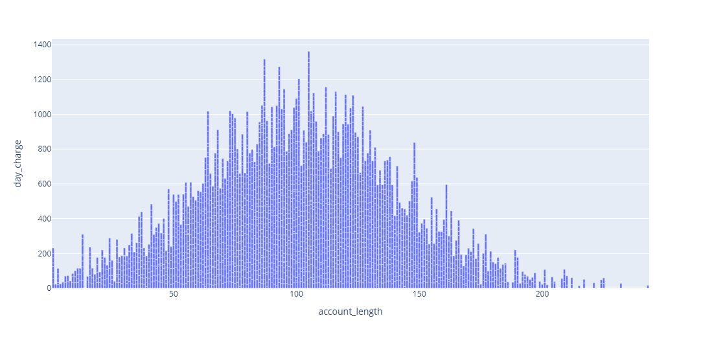
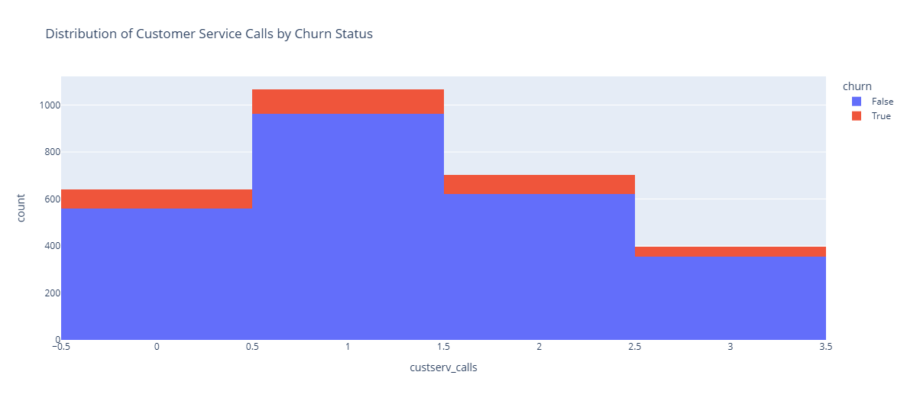
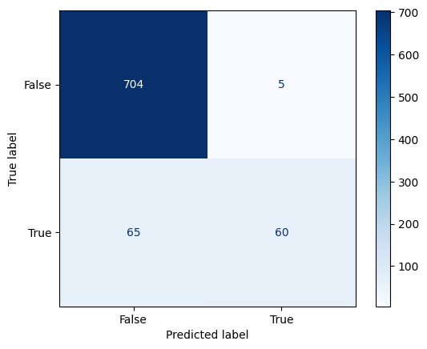

# Cell-Phone-Analysts
Evaluating customer usage patterns, including day and night call and text charges, call minutes, and interactions with customer support, to predict whether customer will churn.

## Goal

- The primary goal is to develop a predictive model that can classify customers as either potential churners or non-churners based on their plan usage patterns.
 
- Build a predictive model that anticipates whether a customer is likely to unsubscribe or switch to another cell phone plan. Churning, in this scenario, refers to the customer discontinuing their current plan.

## Data Dictionary 

| Column Name | Description |
|-------------|-------------|
| `Account_length`    | amount of time the customer has had an account |
| `vmail_message`    | number of voicemail messages a customer has |
| `day_mins`     | how many minutes calls lasted during the daytime |
| `day_calls`     | number of calls in the daytime |
| `day_charge`     | charges accumulated during the daytime |
| `eve_mins`     | 	how many minutes calls lasted during the evening |
| `eve_calls`     | number of calls in the evening |
| `night_mins`     | charges accumulated during the evening |
| `night_calls`     | how many minutes calls lasted during the night |
| `night_charge`     | number of calls in the night |
| `intl_mins`     | charges accumulated during the night |
| `intl_calls`     | number of calls internationally |
| `intl_charge`     | charges for international calls |
| `custserv_calls`     | 	number of customer service calls |
| `churn`     | did the customer churn or not |  

 

## Summary 
### Data Cleaning Steps
The dataset contain no missing value or NaN values. 
Outliers were deteched using IQR method and removed. 

This shows the column `custserve_call` before and after the outliers were removed. 

 

### Key Visualizations

#### Visualization 1:
This shows the duration of the account length and the day charge made, as you can see the highest charge was around the 100 day, so custumers are spending most of there time on custumer service and slowly sinking to close there account there after

#### Visualization 2:
This graphs shows the Distribution of Customer Service Calls by Churn Status( by the number of custumers likly to switch). As you can see, custumers call Jump, in the first  3 days and slowly rescinded gradually.

 

## Conclusions/ Recommendations 
Here are the results of Models, I tested 3 different classification models. Out of all the models I tested The Random Forrest provided the highest score. 

Since `churn` was a boolean variable (True/False), it was difficult using Regression on tha columns, so I switch to Classification.

|Model   | Score |
|--------|---    |
| KNeightbors      |  0.88     |
| Linear Regression |  0.85     |
| Random Forest    |  0.91     |

This is a graph of Random Forest and its showing that the classification is reading 65 values as false and 60 values as True. 
